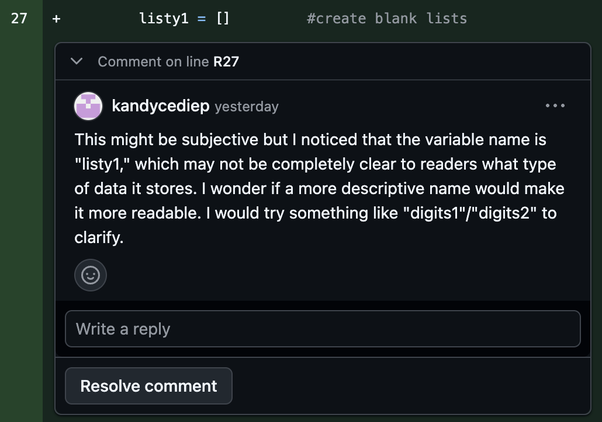
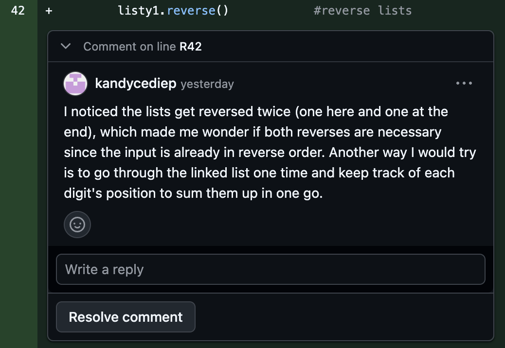
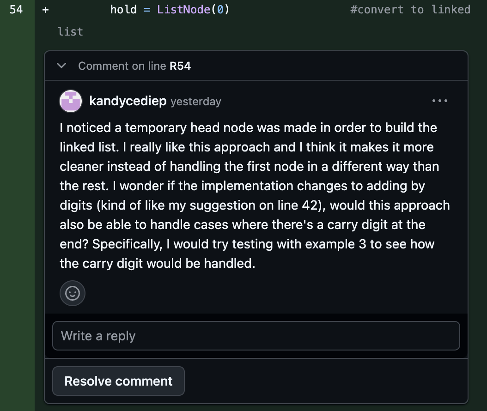
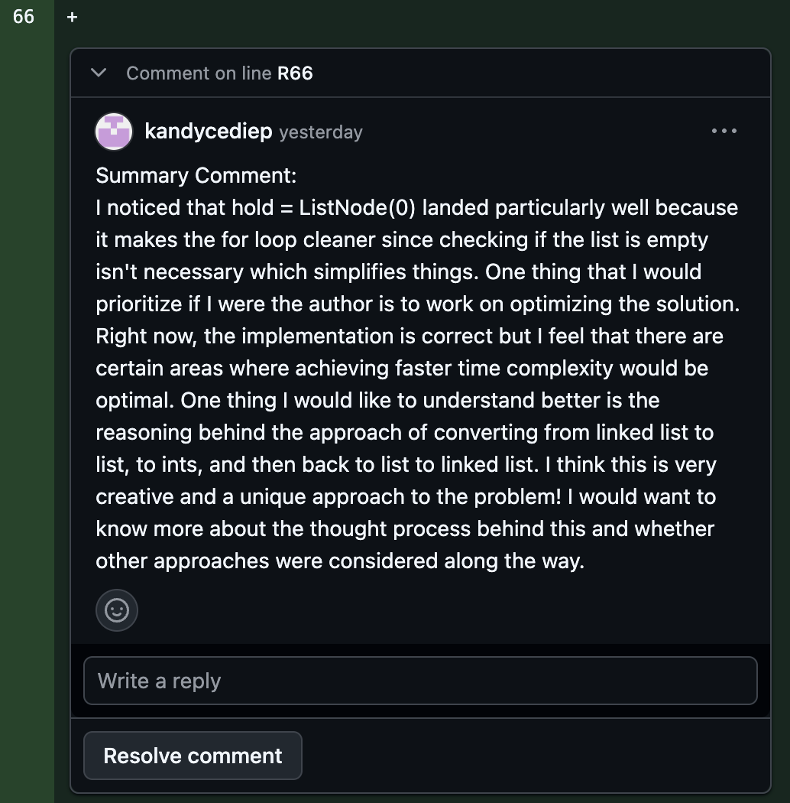

# Module 3

## Artifact: Peer Code Review

**GitHub PR Link:** https://github.com/anyaiolii/tla-mod3/pull/1

I completed a code review on a peer's pull request. I focused on giving feedback using the N/W/WT structure.

---

## Reflection

### 1. Hardest Feedback to Write

The hardest feedback to write for me was the comment on line 54 because it was an approach that I thought worked well. This made framing it into constructive feedback more difficult since I had to think more about the "I wonder" and "I would try" parts of the N/W/WT structure.

### 2. What I Would Change Next Time

Next time, I would spend more time reading through and understanding the code so I have the big picture in my mind before commenting. This would help avoid making similar observations and save time from having to go back and revise comments I had already written.

---

## Screenshots of My Comments

