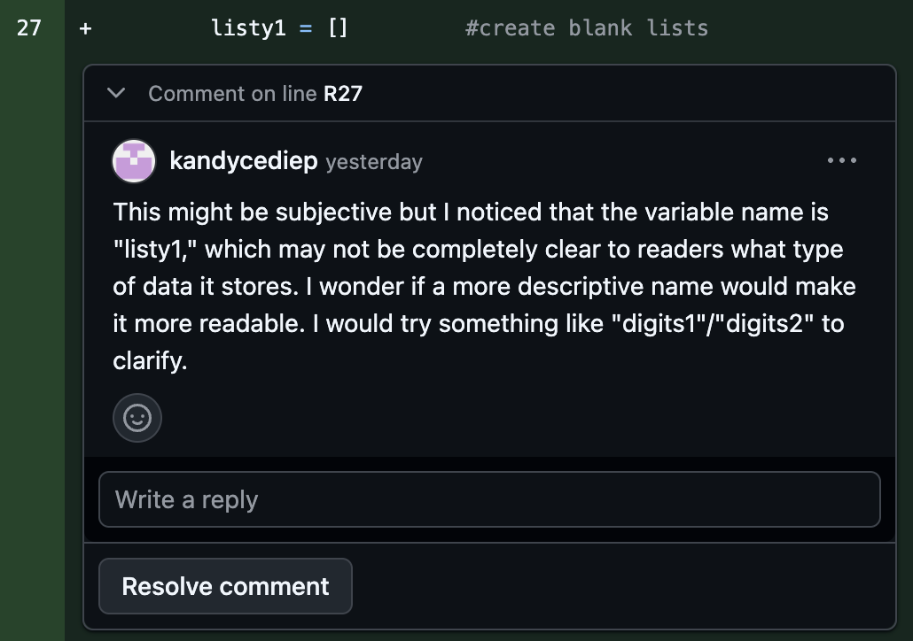
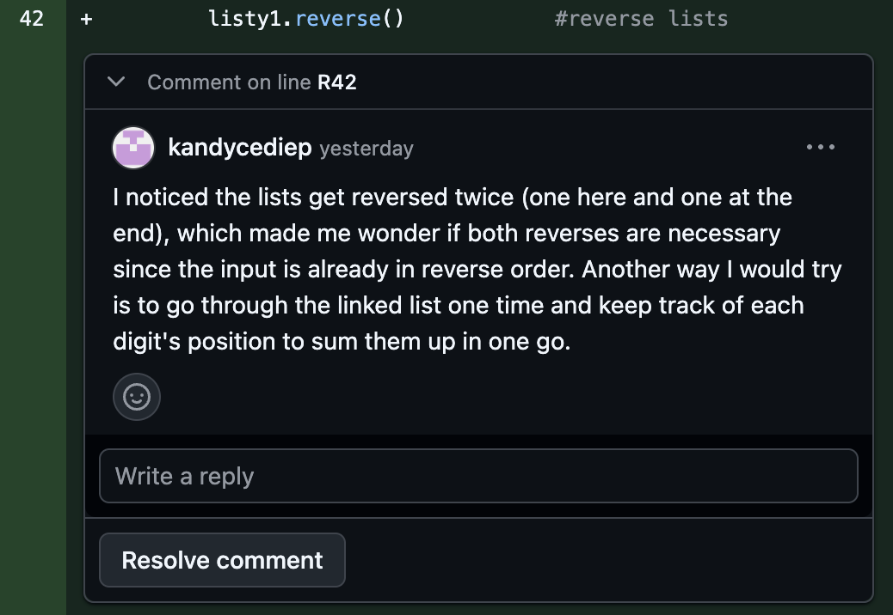
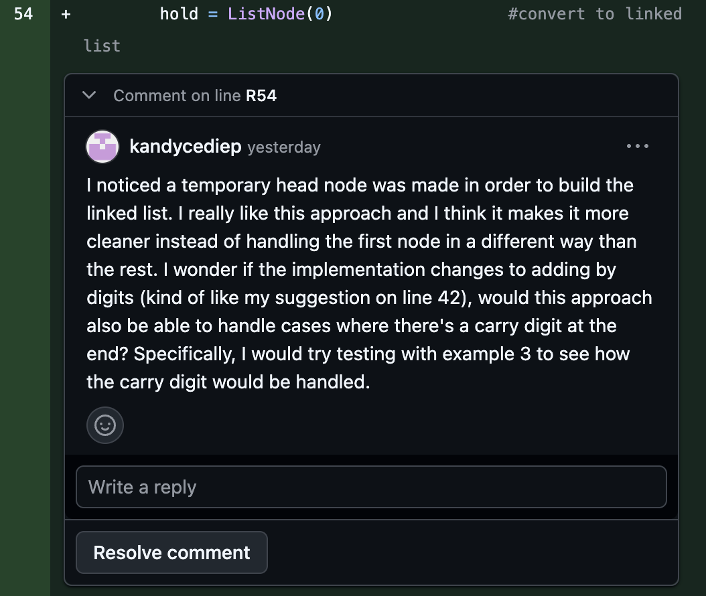
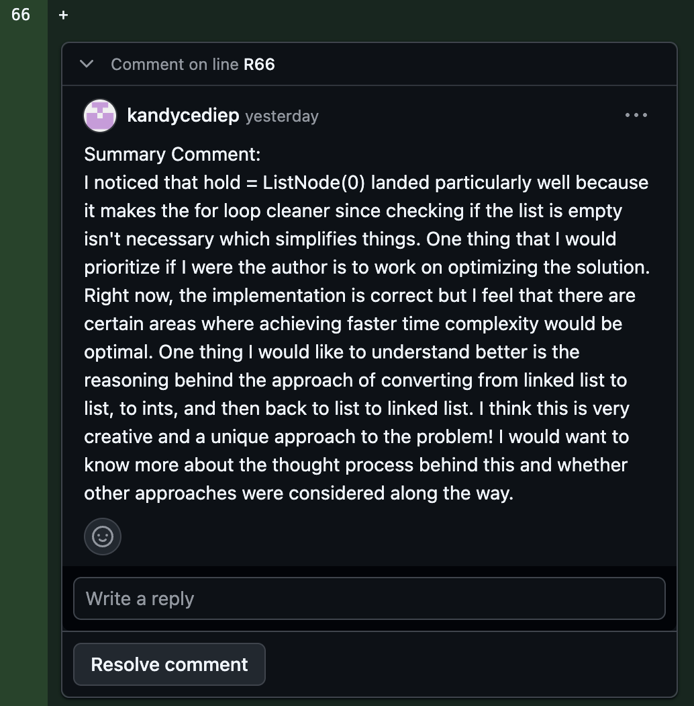

# Module 3

*Formally review code submitted by a peer.*

**Target Skills: Code Review, Feedback Delivery**

## Task

Formally review a peer’s code submission through a GitHub pull request. The goal was to practice providing constructive feedback using the N/W/WT framework while identifying strengths, areas for improvement, and questions about the code.

## Process

I reviewed my partner’s pull request by reading through the code, understanding the overall approach, and leaving inline comments using the N/W/WT structure. I focused on making feedback specific and actionable by explaining what I noticed, what worked well, and what I wondered about or would try differently. I also provided a summary review highlighting strengths and possible areas for improvement.

## Deliverable

### Peer Code Review

**GitHub PR Link:** https://github.com/anyaiolii/tla-mod3/pull/1

## Screenshots of My Comments

## Reflection

### 1. Hardest Feedback to Write

The hardest feedback to write for me was the comment on line 54 because it was an approach that I thought worked well. This made framing it into constructive feedback more difficult since I had to think more about the "I wonder" and "I would try" parts of the N/W/WT structure.

### 2. What I Would Change Next Time

Next time, I would spend more time reading through and understanding the code so I have the big picture in my mind before commenting. This would help avoid making similar observations and save time from having to go back and revise comments I had already written.
